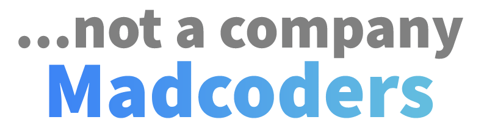

# Sylius Plugin Skeleton Generator

## Features
- generate plugin skeleton with own plugin name and namespace

## License

This library is under the [EUPL 1.2](LICENSE) license.

## Credits

Developed by [MADCODERS](https://madcoders.co)    
Architects of this package:  
- [Piotr Lewandowski](https://github.com/plewandowski) 
- [Leonid Moshko](https://github.com/LeoMoshko)

